# MyNutrition Module + Apple Watch Companion -- Architecture Report

**Date:** 2026-03-06
**Scope:** Full implementation of `@mylife/nutrition` module (Phases 1-9) with Apple Watch integration for MyFast

---

## 1. System Architecture Overview

```mermaid
graph TB
    subgraph HubShell["MyLife Hub Shell"]
        MobileApp["Expo Mobile App<br/>(apps/mobile)"]
        WebApp["Next.js 15 Web App<br/>(apps/web)"]
    end

    subgraph Packages["Shared Packages"]
        ModReg["@mylife/module-registry<br/>Module lifecycle, types, hooks"]
        DB["@mylife/db<br/>SQLite adapter, migrations"]
        UI["@mylife/ui<br/>Dark theme, components, tokens"]
    end

    subgraph NutritionModule["@mylife/nutrition (modules/nutrition/)"]
        Definition["ModuleDefinition<br/>id: 'nutrition' | prefix: 'nu_'"]
        Schema["SQLite Schema<br/>9 tables + FTS5"]
        CRUD["CRUD Layer<br/>foods, log, goals, settings"]
        Search["Search Engine<br/>FTS5 + unified API"]
        APIs["External APIs<br/>Open Food Facts, FatSecret"]
        AI["AI Photo Log<br/>Claude Vision API"]
        Stats["Stats Engine<br/>daily, weekly, monthly, micros"]
        Bridge["MyFast Bridge<br/>cross-module ft_ reads"]
        Export["CSV Export<br/>food log + summary"]
    end

    subgraph WatchApp["Apple Watch (SwiftUI)"]
        WatchMain["MyFastWatchApp<br/>3-tab: Timer, Water, Food"]
        FastState["FastState<br/>fasting timer + zones"]
        NutState["NutritionState<br/>calories, goal, favorites"]
        WCManager["WatchConnectivityManager<br/>WCSession delegate"]
        Complications["WidgetKit Complications<br/>4 widgets"]
    end

    subgraph WatchBridge["Watch Bridge Layer (TypeScript)"]
        BridgeTS["WatchBridge.ts<br/>send state, receive actions"]
        SyncHook["useWatchSync.ts<br/>React hook for bidirectional sync"]
    end

    MobileApp -->|registers| ModReg
    MobileApp -->|reads/writes| DB
    MobileApp -->|themed by| UI
    WebApp -->|registers| ModReg
    WebApp -->|reads/writes| DB
    WebApp -->|themed by| UI

    ModReg -->|loads| Definition
    DB -->|runs migrations| Schema
    Definition -->|declares| Schema

    MobileApp -->|renders screens| CRUD
    MobileApp -->|calls| Search
    MobileApp -->|calls| AI
    MobileApp -->|reads| Stats
    WebApp -->|server actions| CRUD
    WebApp -->|server actions| Search
    WebApp -->|reads| Stats

    Search -->|local first| CRUD
    Search -->|fallback| APIs
    APIs -->|caches results| CRUD
    AI -->|creates foods| CRUD
    Stats -->|aggregates| CRUD
    Bridge -->|reads ft_ tables| DB

    MobileApp -->|iOS only| BridgeTS
    BridgeTS -->|sendMessage / appContext| WCManager
    SyncHook -->|wraps| BridgeTS
    WCManager -->|updates| FastState
    WCManager -->|updates| NutState
    WCManager -->|sendAction| BridgeTS

    WatchMain --> FastState
    WatchMain --> NutState
    WatchMain --> WCManager
    Complications -->|reads UserDefaults| FastState
    Complications -->|reads UserDefaults| NutState
```

---

## 2. Module Package Architecture

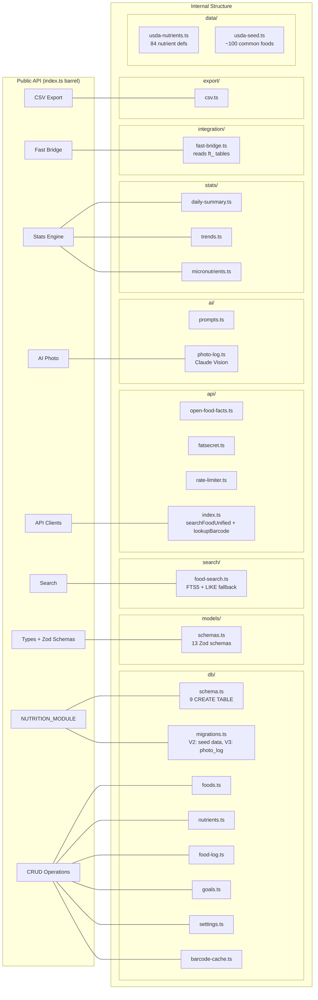

---

## 3. Database Schema (9 tables + FTS5)

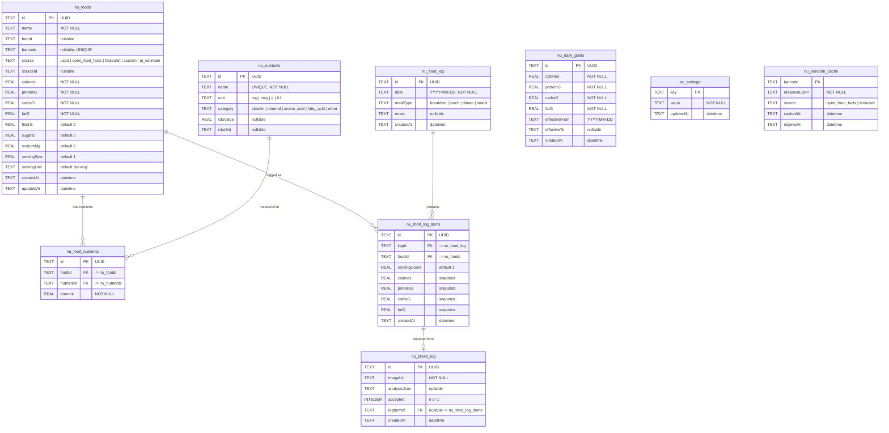

### FTS5 Virtual Table

```sql
nu_foods_fts (name, brand, barcode)   -- content='nu_foods', content_rowid='rowid'
```

Kept in sync via `AFTER INSERT`, `AFTER DELETE`, and `AFTER UPDATE` triggers on `nu_foods`.

### Table Prefix Convention

All nutrition tables use the `nu_` prefix, following MyLife's single-SQLite-file architecture where each module owns a namespace (`bk_` books, `bg_` budget, `ft_` fast, `nu_` nutrition, etc.).

---

## 4. Cross-Module Integration: MyFast Bridge

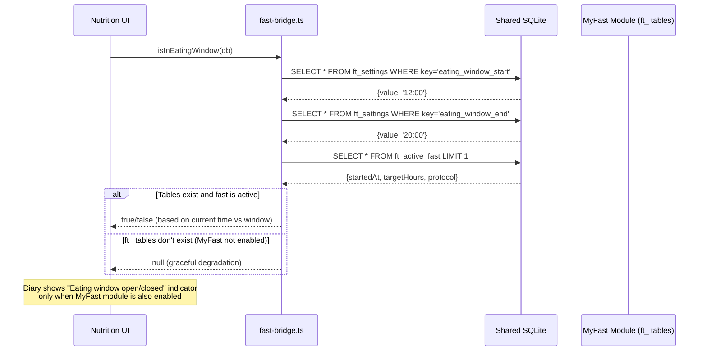

The nutrition module reads MyFast's `ft_settings` and `ft_active_fast` tables directly (read-only cross-module access). If the fast module isn't enabled, the bridge returns `null` and the UI hides the eating window indicator. This is a deliberate coupling point: nutrition is aware of fasting schedules to help users log food within their eating windows.

---

## 5. Food Search Pipeline

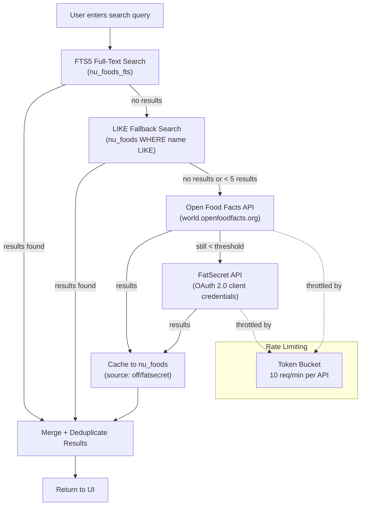

### Barcode Lookup Pipeline

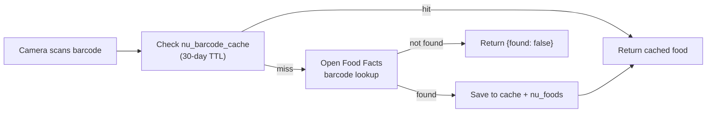

---

## 6. AI Photo Food Logging

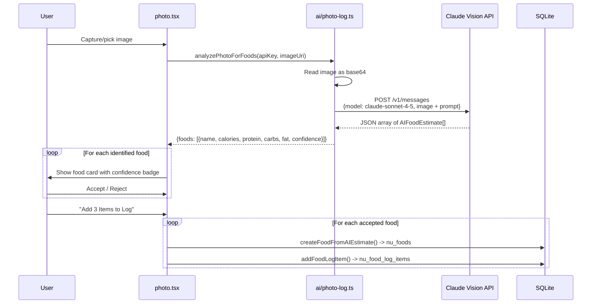

The AI prompt instructs Claude to return structured JSON with food name, estimated serving size, macronutrients, and a confidence level (high/medium/low). Each estimate gets a colored confidence badge in the UI. Users review and accept/reject each item before it touches the database.

---

## 7. Apple Watch Architecture

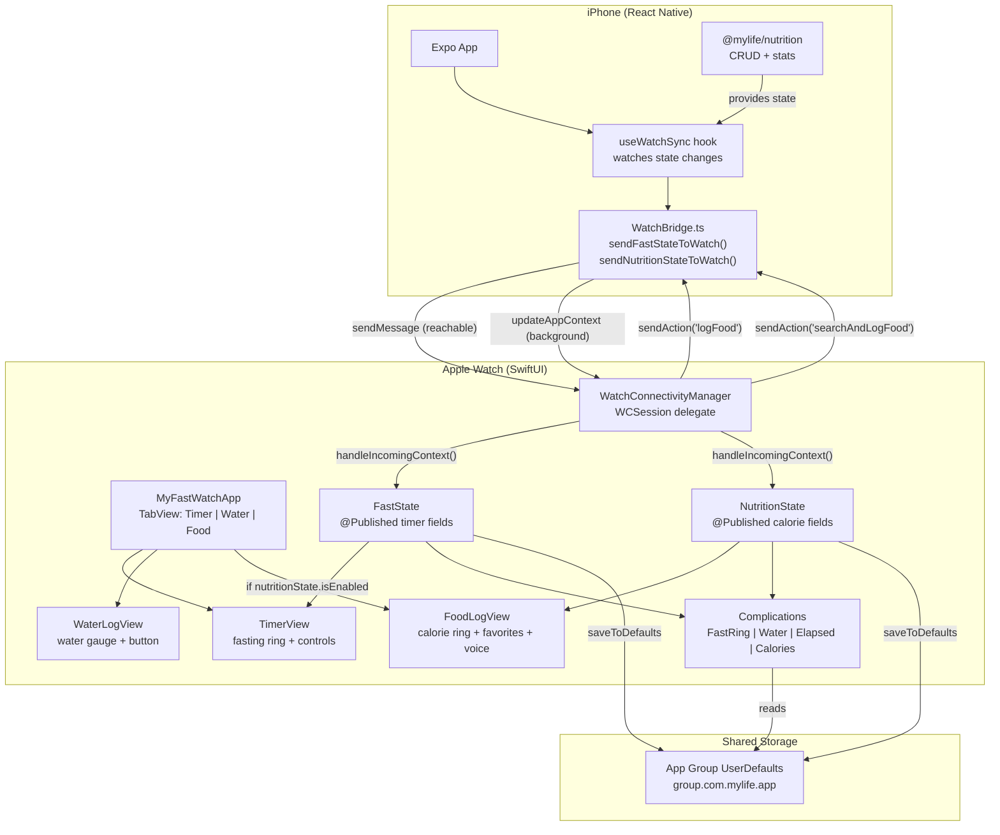

### Watch Communication Protocol

| Direction | Method | When Used |
|-----------|--------|-----------|
| Phone -> Watch | `sendMessage()` | Both devices active (immediate) |
| Phone -> Watch | `updateApplicationContext()` | Watch sleeping (queued) |
| Watch -> Phone | `sendMessage()` | Phone reachable (immediate) |
| Watch -> Phone | `transferUserInfo()` | Phone unreachable (queued) |

### Watch Actions (Watch -> Phone)

| Action | Payload | Handler |
|--------|---------|---------|
| `startFast` | `{protocol, targetHours}` | `onStartFast` callback |
| `stopFast` | `{}` | `onStopFast` callback |
| `logWater` | `{}` | `onLogWater` callback |
| `logFood` | `{foodId, servingCount}` | `onLogFood` callback |
| `searchAndLogFood` | `{query}` | `onSearchAndLogFood` callback |

### Watch State Payloads (Phone -> Watch)

**Fast State:** `isActive`, `startedAt` (unix), `targetHours`, `protocol`, `waterCount`, `waterGoal`, `streak`

**Nutrition State:** `nutritionEnabled`, `todayCalories`, `calorieGoal`, `recentFoods[]` (id, name, calories, servingUnit)

---

## 8. Hub Integration Points

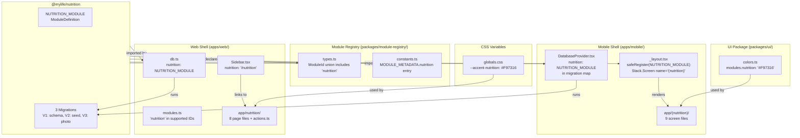

### Module Lifecycle

1. **Registration:** Hub app imports `NUTRITION_MODULE` and calls `safeRegister()` at startup
2. **Enable:** User toggles nutrition ON in hub dashboard -> SQLite migrations run (V1: 9 tables, V2: seed 84 nutrients + ~100 foods + FTS triggers, V3: photo_log table)
3. **Active:** Navigation routes activate, dashboard card appears with salad emoji and `#F97316` accent
4. **Disable:** Routes removed, card hidden, **data preserved** (never deleted on disable)
5. **Re-enable:** Routes reactivate, existing data intact

---

## 9. Mobile Screen Map

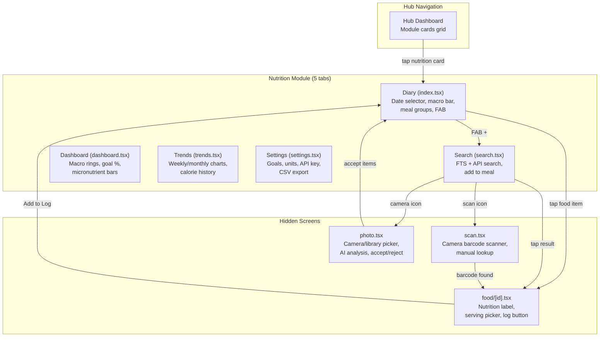

---

## 10. Web Page Map

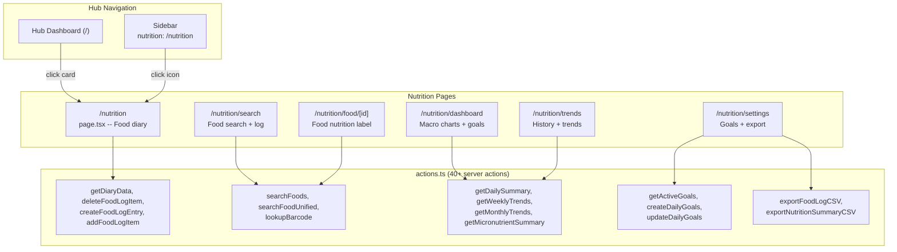

---

## 11. Stats Engine

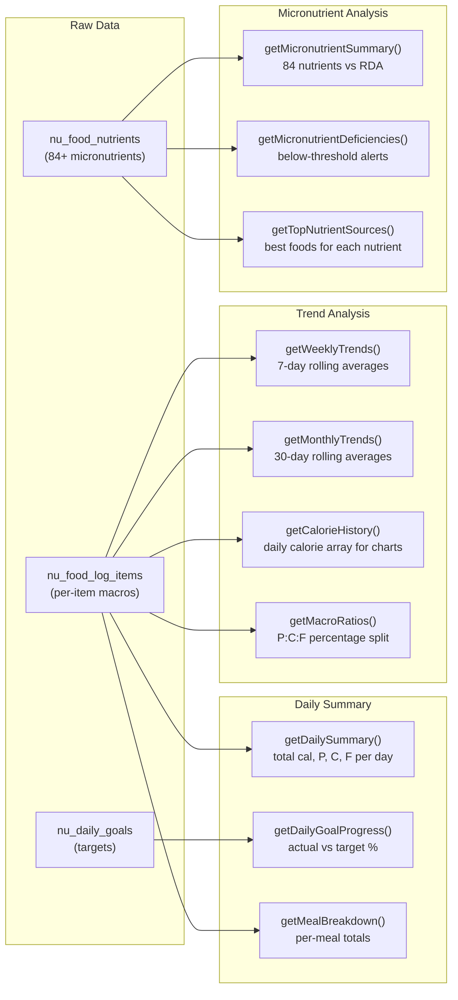

### Nutrient Status Classification

| Status | Condition | Dashboard Color |
|--------|-----------|----------------|
| `deficient` | < 50% RDA | Red `#EF4444` |
| `low` | 50-80% RDA | Amber `#EAB308` |
| `adequate` | 80-120% RDA | Green `#22C55E` |
| `high` | 120-200% RDA | Blue `#3B82F6` |
| `excessive` | > 200% RDA | Purple `#A855F7` |

---

## 12. Test Coverage

| Test File | Tests | What It Covers |
|-----------|-------|----------------|
| `schema.test.ts` | 9 | All 9 tables created, indexes exist, FTS virtual table, triggers |
| `foods-crud.test.ts` | 15 | Food CRUD, barcode lookup, FTS search, settings CRUD, barcode cache |
| `food-log.test.ts` | 8 | Log entries, log items, daily totals aggregation, cascading deletes |
| `goals.test.ts` | 5 | Goal CRUD, date-range effective lookups, goal updates |
| `stats.test.ts` | 8 | Daily summary, goal progress, weekly/monthly trends, macro ratios |
| `fast-bridge.test.ts` | 4 | Eating window detection, graceful degradation when ft_ tables missing |
| `export.test.ts` | 6 | Food log CSV format, nutrition summary CSV, empty-state handling |
| `ai-photo.test.ts` | 7 | Prompt construction, response parsing, error handling, type guards |
| **Total** | **62** | Full coverage of business logic layer |

---

## 13. File Inventory

### New Files Created (55 files)

**Module package (`modules/nutrition/`)** -- 35 files:
```
package.json, tsconfig.json, vitest.config.ts
src/index.ts, src/types.ts, src/definition.ts
src/db/index.ts, src/db/schema.ts, src/db/migrations.ts
src/db/foods.ts, src/db/nutrients.ts, src/db/food-log.ts
src/db/goals.ts, src/db/settings.ts, src/db/barcode-cache.ts
src/models/index.ts, src/models/schemas.ts
src/search/index.ts, src/search/food-search.ts
src/api/index.ts, src/api/types.ts, src/api/rate-limiter.ts
src/api/open-food-facts.ts, src/api/fatsecret.ts
src/ai/index.ts, src/ai/types.ts, src/ai/prompts.ts, src/ai/photo-log.ts
src/stats/index.ts, src/stats/daily-summary.ts, src/stats/trends.ts, src/stats/micronutrients.ts
src/integration/index.ts, src/integration/fast-bridge.ts
src/export/index.ts, src/export/csv.ts
src/data/index.ts, src/data/usda-nutrients.ts, src/data/usda-seed.ts
src/__tests__/ (8 test files)
```

**Mobile screens (`apps/mobile/app/(nutrition)/`)** -- 9 files:
```
_layout.tsx, index.tsx, search.tsx, dashboard.tsx, trends.tsx
settings.tsx, food/[id].tsx, scan.tsx, photo.tsx
```

**Web pages (`apps/web/app/nutrition/`)** -- 8 files:
```
layout.tsx, page.tsx, actions.ts, search/page.tsx
dashboard/page.tsx, trends/page.tsx, settings/page.tsx, food/[id]/page.tsx
```

**Watch companion (`apps/mobile/watch/ios/`)** -- 2 new files:
```
NutritionState.swift, FoodLogView.swift
```

**Watch bridge** -- 1 new file:
```
apps/mobile/plugins/watch-plugin.js
```

### Existing Files Modified (14 files)

| File | Change |
|------|--------|
| `packages/module-registry/src/types.ts` | Added `'nutrition'` to ModuleId union + Zod enum |
| `packages/module-registry/src/constants.ts` | Added nutrition entry to MODULE_IDS + MODULE_METADATA |
| `packages/ui/src/tokens/colors.ts` | Added `nutrition: '#F97316'` to module colors |
| `apps/web/app/globals.css` | Added `--accent-nutrition: #F97316` CSS variable |
| `apps/mobile/app/_layout.tsx` | Import + safeRegister + Stack.Screen for nutrition |
| `apps/mobile/components/DatabaseProvider.tsx` | Import + migration map entry for nutrition |
| `apps/mobile/package.json` | Added `@mylife/nutrition` + `expo-image-picker` deps |
| `apps/web/components/Sidebar.tsx` | Added `nutrition: '/nutrition'` to MODULE_ROUTES |
| `apps/web/lib/modules.ts` | Added `'nutrition'` to WEB_SUPPORTED_MODULE_IDS |
| `apps/web/lib/db.ts` | Import + registration for nutrition module |
| `apps/web/package.json` | Added `@mylife/nutrition` dependency |
| `apps/mobile/watch/ios/MyFastWatchApp.swift` | Added NutritionState + conditional FoodLogView tab |
| `apps/mobile/watch/ios/WatchConnectivityManager.swift` | Added nutritionState ref + handleIncomingContext routing |
| `apps/mobile/watch/ios/ComplicationProvider.swift` | Added nutrition fields to entry + CalorieGaugeWidget |
| `apps/mobile/native/WatchBridge.ts` | Added WatchNutritionState + sendNutritionStateToWatch + food actions |
| `apps/mobile/hooks/useWatchSync.ts` | Added nutrition state sync + food log action handlers |

---

## 14. Verification Results

| Check | Result |
|-------|--------|
| `pnpm --filter @mylife/nutrition typecheck` | Clean (0 errors) |
| `pnpm --filter @mylife/nutrition test` | 62/62 passed |
| `pnpm --filter @mylife/mobile typecheck` | 0 nutrition errors (3 pre-existing billing-config) |
| `pnpm --filter @mylife/web typecheck` | 0 nutrition errors (2 pre-existing billing-config) |
| `pnpm check:module-parity` | Passed (1 warning: meds design-only) |
| `pnpm check:parity` | Passed |
